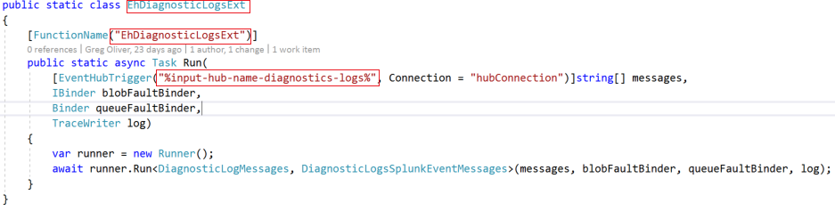
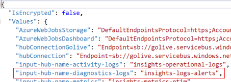
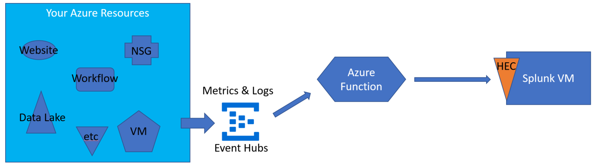

# AzureFunctionForSplunkVS
Azure Function sends Azure Monitor telemetry to Splunk - coded in C# / Visual Studio 2017.

[](https://portal.azure.com/#create/Microsoft.Template/uri/https%3A%2F%2Fraw.githubusercontent.com%2Fsebastus%2FAzureFunctionDeployment%2FSplunkVS%2FazureDeploy.json)  

# Azure Function For Splunk
Azure Function code that sends telemetry from Azure resources to a Splunk Enterprise or Splunk Cloud instance.

It consumes Metrics, Diagnostic Logs and the Activity Log according to the techniques defined by Azure Monitor, which provides highly granular and real-time monitoring data for Azure resources, and passes those selected by the user's configuration along to Splunk. 

Here are a few resources if you want to learn more about Azure Monitor:<br/>
* [Overview of Azure Monitor](https://docs.microsoft.com/en-us/azure/monitoring-and-diagnostics/monitoring-overview)
* [Overview of Azure Diagnostic Logs](https://docs.microsoft.com/en-us/azure/monitoring-and-diagnostics/monitoring-overview-of-diagnostic-logs)
* [Overview of the Azure Activity Log](https://docs.microsoft.com/en-us/azure/monitoring-and-diagnostics/monitoring-overview-activity-logs)
* [Overview of Metrics in Microsoft Azure](https://docs.microsoft.com/en-us/azure/monitoring-and-diagnostics/monitoring-overview-metrics)  

## Important Security Note
The HEC endpoint for a Splunk instance is SSL encrypted. This function CAN ignore the validity of the certificate. To do so, do not provide App Setting 'splunkCertThumbprint' or leave it blank. To ENABLE cert validation, make the value of that setting the thumbprint of the cert. If you provide the cert thumbprint, the splunkAddress must be https://**whatever**. If you do not provide the cert thumbprint, the splunkAddress must be http://**whatever**.

## Solution Overview

At a high level, the Azure Functions approach to delivering telemetry to Splunk does this:
* Azure resources deliver telemetry to event hubs
* Azure Function is triggered by these messages
* Azure Function delivers the messages to Splunk

Azure Functions are arranged hierarchically as a Function App containing individual functions within. An individual function is triggered by a single event hub. Regarding logs from Azure Monitor, each log category CAN BE sent to its own hub. Each Azure Resource Provider that emits logs may emit more than one log category. Similarly, metrics are sent to a hub as configured by the user. Hence, there MAY BE many hubs for the Function App to watch over. BUT, you can configure all diagnostic logs to go to the same hub. This practice is recommended for simplicity's sake.  

## Adding additional hubs

If you choose to allow Azure services with diagnostic logs to create their default hubs, you will need to create additional functions (in addition to the list just below) - one per additional hub. The reason for this is that each function is triggered by exactly one hub.  

Do this by copying EhDiagnosticLogsExt.cs and name the copy according to the new event hub. For example, if you wanted to use the default hub for Workflow Runtime messages, the default hub name is 'insights-logs-workflowruntime'. You could name your new function 'EhWorkflowRuntimeExt', for example. This is a copy of the code:  

  

Change the first box to 'EhWorkflowRuntimeExt', the second to the same, and the third to something like "%input-hub-name-workflow-runtime%". Then, in the settings create a new one like the following:  

  

Make the setting key match what you put in the 3rd box above ("%input-hub-name-workflow-runtime%") and the value should be the name of your new hub (e.g. insights-logs-workflowruntime). Rebuild and deploy the function app. This is as simple as making your own fork of the code, add the new function & customize it, push and merge your changes to your fork, then use the "Deploy to Azure" (customized to point to your fork) button here in the README.md (above).

### Functions in the Function App
* EhActivityLogsExt - consumes Azure Monitor Activity Logs
* EhDiagnosticLogsExt - consumes Azure Monitor Diagnostic Logs
* EhLadTelemetryExt - consumes telemetry from Azure Linux VMs
* EhMetricsExt - consumes Azure Monitor Metrics
* EhWadTelemetryExt - consumes telemetry from Azure Windows VMs  
* FaultProcessor - consumes queue messages from faulted transmissions

The Activity Log transmits to a hub named 'Insights-Operational-Logs'. This will be configurable at some point, but for now, the function should be configured to listen to that hub.

The solution leverages the capacity of an Azure Function to be triggered by arrival of messages to an Event Hub. The messages are aggregated by the Azure Functions back end so they arrive at the function already in a batch where the size of the batch depends on current message volume and settings. The batch is examined, the properties of each event are augmented, and then the events are sent via the selected output binding to the Splunk instance.  

### Cloud-based Splunk using HTTP Event Collector Output Binding


The image shows only Splunk VM, but the solution targets Splunk Cloud as well. The Splunk VM may be Splunk Enterprise or a Forwarder.  

## Installation and Configuration

Installation and Configuration tasks for the overall solution fall into a few buckets:

* Diagnostics profiles 
* Event hubs
* Splunk instance
* Azure Function

### Diagnostics Profiles
Each resource to be monitored must have a diagnostics profile created for it. This can be done in the portal, but more likely you'll want to write a script to configure existing resources and update your solution templates to create these profiles upon creation of the resource. Here's a place to start:

[Automatically enable Diagnostic Settings at resource creation using a Resource Manager template](https://docs.microsoft.com/en-us/azure/monitoring-and-diagnostics/monitoring-enable-diagnostic-logs-using-template)

### Diagnostic Profiles for VMs
Each VM to be monitored by the function app requires configuration artifacts:  
* Diagnostic Extension designed for the OS
* public configuration file - tells the extension which metrics and logs you want to emit from the VM
* private configuration file - contains credentials for the targets of the VMs telemetry  

For Linux VMs, guidance on installing the extension and guidance on designing the configuration files is in this document  
[Use Linux Diagnostic Extension to monitor metrics and logs](https://docs.microsoft.com/en-us/azure/virtual-machines/extensions/diagnostics-linux)  
For Windows VMs, that same guidance is here:  
[Use PowerShell to enable Azure Diagnostics in a virtual machine running Windows](https://docs.microsoft.com/en-us/azure/virtual-machines/extensions/diagnostics-windows)  

The private configuration file for a Linux VM will require a SAS token. A sample of C# code that generates a suitable SAS token is [here](https://github.com/sebastus/GenerateSasForEh). The sasURL in the protected config file will look something like this:  

```
https://namespace.servicebus.windows.net/insights-telemetry-lad?sr=https%3a%2f%2fnamespace.servicebus.windows.net%2finsights-telemetry-lad&sig=wsVxC%2f%2bm7vRhOZjm%2fJMEWTX%2by0sOil6z%2bFqwoWrstkQ%3d&se=1562845709&skn=RootManageSharedAccessKey  
```

### Event hubs

As mentioned, logs and metrics are sent through event hubs. Event hubs are created automatically by the Azure resource providers that need to write the information, so at the outset all you need to do is create the Event Hub Namespace. Here's how to do this in the portal:

[Create an Event Hubs namespace and an event hub using the Azure portal](https://docs.microsoft.com/en-us/azure/event-hubs/event-hubs-create)

You will need to provide credentials to the Azure Function so it can read the hubs. On one end of the security spectrum you could provide the RootManageSharedAccessKey to all functions for all hubs within the namespace. At the other end of the spectrum (following the principal of least required authority) you can create a policy for each hub with Listen access and provide that credential on a function-by-function basis.

An example of copying the connection string (NOT just the key) associated with the RootManageSharedAccessKey policy is given on [this page](https://docs.microsoft.com/en-us/azure/event-hubs/event-hubs-create) at the bottom of the page.  

To create a least permissions policy:
* Select the hub from the list of hubs on the event hub namespace blade
* Select "Shared access policies"
* Click "+ Add"
* Give it a name, select "Listen", click "Create" button.
* Once it's created, re-enter the properties for that new policy and copy the connection string (NOT just the key).

### Splunk Instance

#### Using HEC output binding
Configuration of the Splunk instance amounts to opening the HEC endpoint and creating/copying the authentication token. The endpoint address and token value must be entered as settings into the Function App.

Instructions for opening the endpoint and creating/copying the token are on this Splunk webpage:  

[HTTP Event Collector walkthrough](http://dev.splunk.com/view/event-collector/SP-CAAAE7F#usinghttpeventcollector)

### Azure Function

There are several ways to create an Azure Function and load your code into it. Here's one such example:

[Create your first function using the Azure CLI](https://docs.microsoft.com/en-us/azure/azure-functions/functions-create-first-azure-function-azure-cli)

This technique requires that your code be referencable in a github repo, and this is exactly what we need.

Because the repo needs to contain settings specific to your installation, I recommend you fork this repo and make your changes there. Then provide the address of your fork in the example above to populate your function app.

Note that the actual settings are not in the code. These are provided by you in the portal.

If you want to automate the creation of your Azure Function (recommended), there is a solution template that accomplishes this located here:

[Azure Function Deployment ARM template.](https://github.com/sebastus/AzureFunctionDeployment/tree/SplunkVS)

Use the SplunkVS branch in the link. It's configured specifically for this function.  

Or, just click the "Deploy to Azure" button at the top of this page.  

Once the Function App exists, check and correct application settings. The settings are created automatically if you use the ARM template (the 'Deploy to Azure' button.)  

You will then need to create an Azure Storage Queue in the storage account. Its name is case-sensitive: "transmission-faults". On the "Function app settings" page, switch "Function app edit mode" to Read/Write and then disable the FaultProcessor function on the Functions page.

#### Using HEC output binding

* hubConnection - connection string for the hub namespace
* input-hub-name-activity-logs - should be set to 'insights-operational-logs'
* input-hub-name-diagnostics-logs - set to name of hub for diagnostic logs, e.g. insights-diagnostic-logs (or your other custom choice)
* input-hub-name-metrics - 'insights-metrics-pt1m'
* outputBinding - HEC
* splunkAddress - e.g. https://YOURVM.SOMEREGION.cloudapp.azure.com:8088/services/collector/event
* splunkToken - e.g. 5F1B2C8F-YOUR-GUID-HERE-CE29A659E7D1
* splunkCertThumbprint - leave blank to ignore cert validity. This is a good choice if you haven't yet installed your own cert on Splunk Enterprise. Set it to the thumbprint of your cert once it's installed in Splunk Enterprise.


# Contributing

This project welcomes contributions and suggestions.  Most contributions require you to agree to a
Contributor License Agreement (CLA) declaring that you have the right to, and actually do, grant us
the rights to use your contribution. For details, visit https://cla.microsoft.com.

When you submit a pull request, a CLA-bot will automatically determine whether you need to provide
a CLA and decorate the PR appropriately (e.g., label, comment). Simply follow the instructions
provided by the bot. You will only need to do this once across all repos using our CLA.

This project has adopted the [Microsoft Open Source Code of Conduct](https://opensource.microsoft.com/codeofconduct/).
For more information see the [Code of Conduct FAQ](https://opensource.microsoft.com/codeofconduct/faq/) or
contact [opencode@microsoft.com](mailto:opencode@microsoft.com) with any additional questions or comments.
